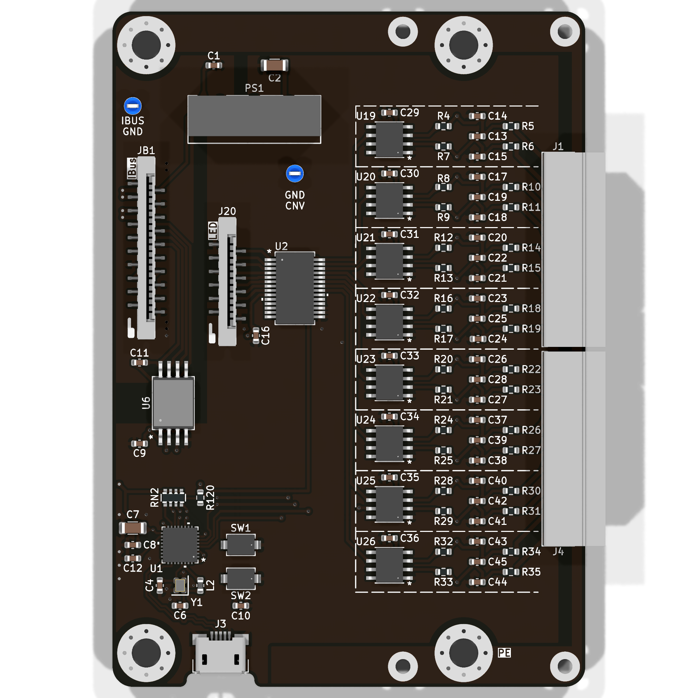
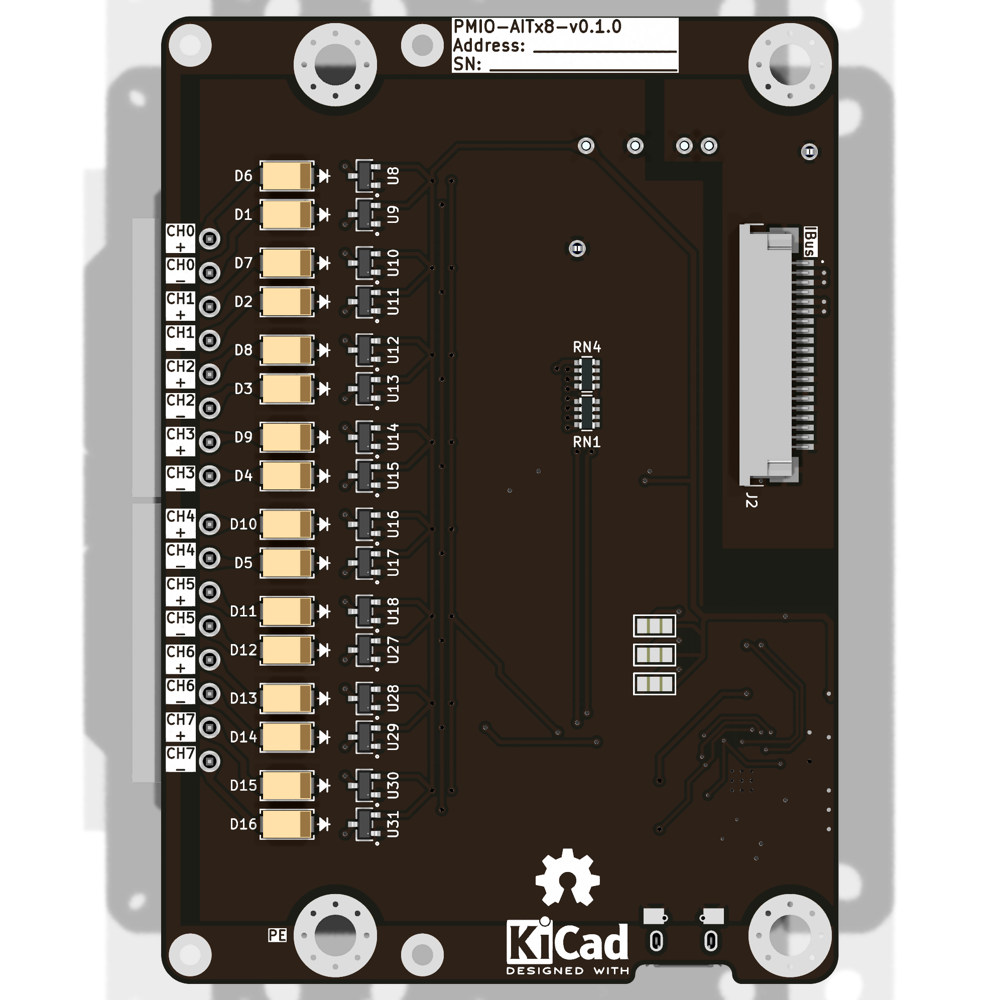

import Options  from '../../../../components/Options.astro';

import Schematic from "./PMIO-AITx8/schematic.svg";
import { options_config } from './PMIO-AITx8/options.ts';

{/* import ExtConn from "./PMIO-AITx8/ext_conn.svg";*/}

Модуль для подключения 8 термопар.

В качестве АЦП используются чипы серии **MAX31855** [^1]. Разрешение АЦП - 14 бит, 0,25 ℃. Встроенная коменсация температуры холодного спая.

## Схема внешних подключений

## Опции

<Options options_config = {options_config} />

## Внешний вид

## Описание

<Schematic />

Распиновка микроконтроллера **ESP32-C3**:

- SPI
  - MISO - GPIO 0
  - SCK - GPIO 1
- I²C:
  - SDA - GPIO 8
  - SCL - GPIO 2
- CAN:
  - RX - GPIO 10
  - TX - GPIO 7

[^1]: **MAX31855** - https://www.analog.com/en/products/max31855.html
