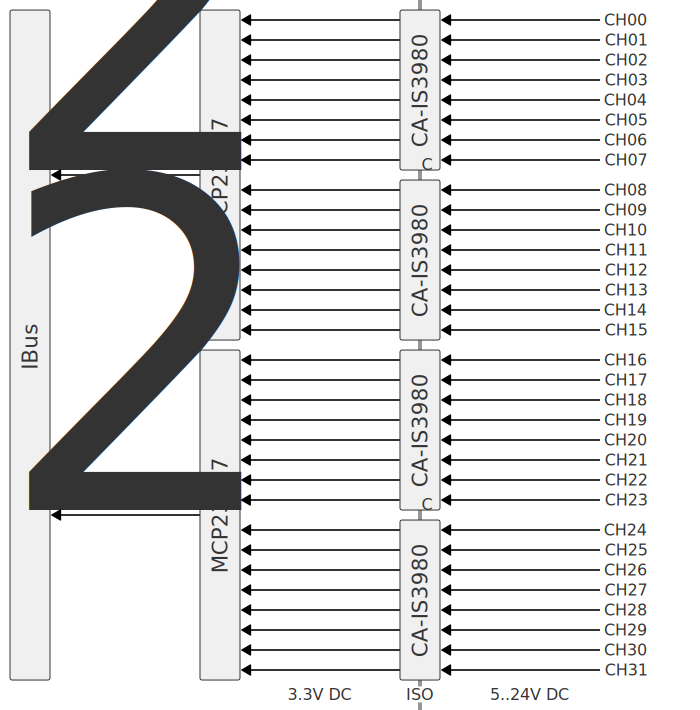

Модуль для подключения 32 дискретных входов постоянного напряжения. Входы гальванически изолированы от внутренней шины IBus.

Выбирая сопротивление резисторов, можно подключать сигналы с напряжением от 5 до 24 В. Напряжение выбирается для групп из 8 каналов.

Датчики можно подключать по схеме PNP или NPN. Конкретный тип выбирается с помощью перемычки на плате. Перемычка задаёт тип схемы для всех 32 каналов в модуле.

## Схема внешних подключений

## Описание

Дискретные входы подключаются к 8-канальному изолятору сигналов CA-IS3980[^1]. Изолятор CA-IS3980 обеспечивает гальваническую изоляцию до 2.5кВ и до ±300кВ/мкс кратковременных помех.

Выходы CA-IS3980 подключаются к 16-канальному расширителю GPIO MCP23017[^2] с интерфейсом I²C. Адрес каждого MCP23017 задаётся перемычками.

Контроллер подключается через внутреннюю шину и опрашивает состояние входов по протоколу I²C.

## Опции

## Расчёт номиналов резисторов

<pre>
$U_F = (I_1 + I_{TH}) ⋅ R_2 + I_1 ⋅ R_1$
</pre>

[^1]: CA-IS3980 - https://e.chipanalog.com/products/interface/isolated/iso5/114.
[^2]: MCP23017 - https://www.microchip.com/en-us/product/mcp23017.
